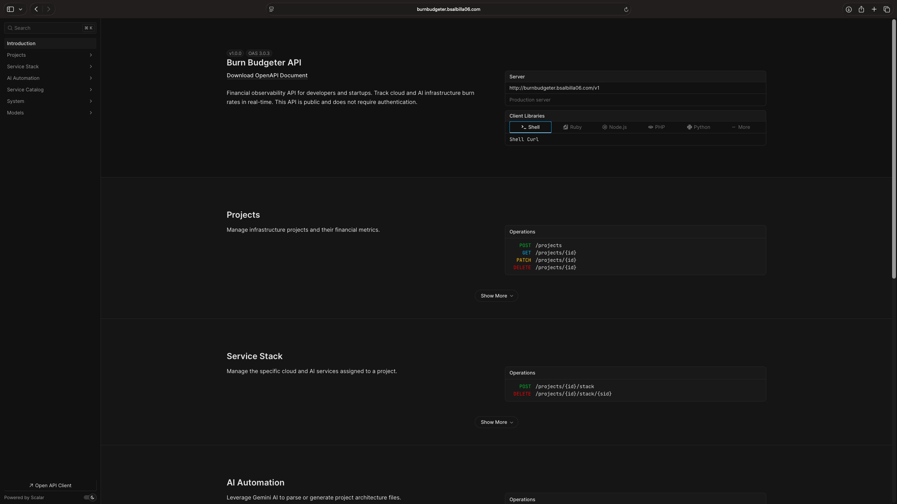

# 🔥 Burn Budgeter

**Financial observability for developers and startups.**

Burn Budgeter is a high-performance API designed to track infrastructure costs in real-time. By analyzing your stack across Cloud (AWS, GCP) and AI (Gemini, OpenAI) providers, it provides instant insights into your monthly burn and estimated runway.



## 🚀 Key Features

*   **Real-Time Analytics:** Instantly calculate monthly burn rate and project your "Death Date" based on cash on hand. 💰
*   **AI Architecture Parser:** ⚡️ Upload an `ARCHITECTURE.md` file, and let Gemini AI automatically detect your services and seed your project's budget.
*   **Cloud & AI Stack Management:** Comprehensive tracking for AWS, GCP, Gemini, OpenAI, and custom services. 🛠️
*   **Architecture Exporter:** Generate professional `ARCHITECTURE.md` files directly from your current project stack.
*   **Public API:** Designed for ease of use with no authentication required for the public catalog.

## 📖 API Documentation

The full interactive API documentation is available at:
👉 **[burnbudgeter.bsalbilla06.com](http://burnbudgeter.bsalbilla06.com)**

## 🛠 Tech Stack

*   **Language:** Go 1.22+ (Standard Library `net/http`)
*   **Database:** Supabase (PostgreSQL)
*   **AI Engine:** Google Gemini API
*   **Documentation:** OpenAPI 3.0 (Scalar)

## 🚦 Getting Started

### Prerequisites

- Go 1.22 or higher
- A Supabase project (PostgreSQL)
- A Google Gemini API Key

### Environment Variables

Create a `.env` file in the root directory:

```env
SUPABASE_DB_CONN=your_postgresql_connection_string
GEMINI_API_KEY=your_gemini_api_key
```

### Running the API

```bash
# Build the binary
make build

# Run the server
make run
```

The API will be available at `http://localhost:8080/v1`.

## 📂 Project Structure

- `cmd/api/`: Application entry point and routing.
- `internal/handlers/`: HTTP request handlers for the JSON API.
- `internal/parser/`: Gemini AI integration logic for architecture parsing.
- `internal/models/`: Domain models and database logic.
- `api/openapi.yaml`: Full API specification.

---
Built for speed and financial clarity.
